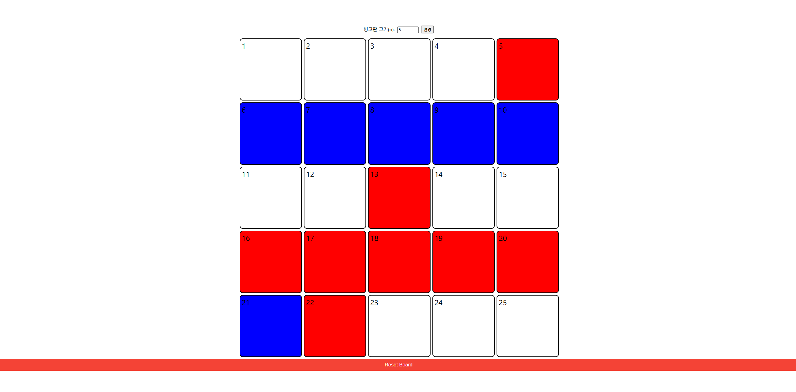

# 빙고 웹앱

<a href="https://bingo-site.netlify.app/" target="_blank">배포된 사이트</a>

## 소개

교회에서의 빙고 레크레이션을 목적으로 제작되었으며, 사용자가 빙고판 크기를 선택할 수 있는 n * n 구조의 빙고판 웹사이트이다.

개발을 하는 데 있어서 단 한 줄의 코드 작성이 없이 오직 AI로만 개발을 진행

## 사용기술
- HTML, CSS
- Javascript
- React.js
- Cursor AI

## Scripts

### 1. INSTALL: `npm install` or `yarn install`
### 2. RUN: `npm start` or `yarn start`
### 3. OPEN http://localhost:3000

